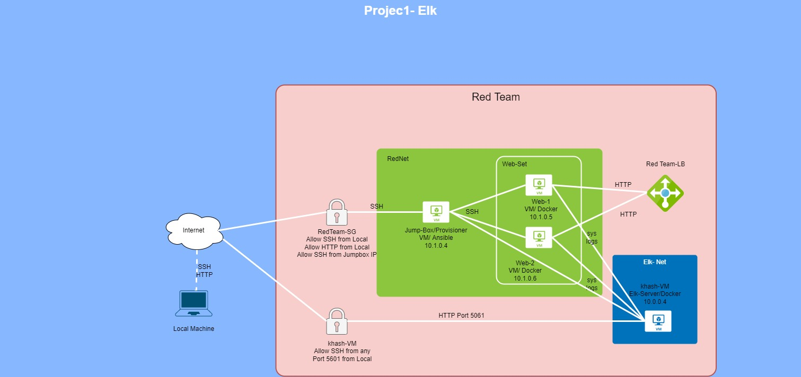
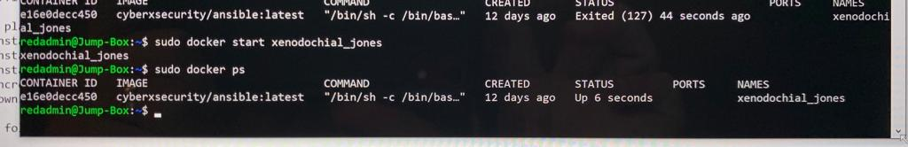

# Project1-UofT# Automated ELK Stack Deployment

The files in this repository were used to configure the network depicted below.



These files have been tested and used to generate a live ELK deployment on Azure. They can be used to either recreate the entire deployment pictured above. Alternatively, select portions of the YAML file may be used to install only certain pieces of it, such as Filebeat.

[install-elk.yml](Ansible/install-elk.yml)
  
```
---
# install_elk.yml
- name: Configure Elk VM with Docker
  hosts: elk
  remote_user: sysadmin
  become: true
  tasks:
    # Use apt module
    - name: Install docker.io
      apt:
        update_cache: yes
        name: docker.io
        state: present

      # Use apt module
    - name: Install pip3
      apt:
        force_apt_get: yes
        name: python3-pip
        state: present

      # Use pip module
    - name: Install Docker python module
      pip:
        name: docker
        state: present

      # Use command module
    - name: Increase virtual memory
      command: sysctl -w vm.max_map_count=262144

      # Use sysctl module
    - name: Use more memory
      sysctl:
        name: vm.max_map_count
        value: "262144"
        state: present
        reload: yes

      # Use docker_container module
    - name: download and launch a docker elk container
      docker_container:
        name: elk
        image: sebp/elk:761
        state: started
        restart_policy: always
        published_ports:
          - 5601:5601
          - 9200:9200
          - 5044:5044
```
This document contains the following details:
1. Description of the Topology
2. Access Policies
3. ELK Configuration
4. Beats in Use
5. Machines Being Monitored
6. How to Use the Ansible Build

### Description of the Topology

The main purpose of this network is to expose a load-balanced and monitored instance of DVWA, the D*mn Vulnerable Web Application.

Load balancing ensures that the application will be highly available, in addition to restricting in-bound to the network.
A load balancer intelligently distributes traffic from clients across multiple servers without the clients having to understand 
how many servers are in use or how they are configured. Because the load balancer sits between the clients and the servers it can 
enhance the user experience by providing additional security, performance, resilience and simplify scaling your website. 

Integrating an ELK server allows users to easily monitor the vulnerable VMs for changes to the jumpbox and system network.
- What does Filebeat watch for? Changes to file changes on the machine.
- What does Metricbeat record?  Collect metrics from the operating system and from services running on the server.

The configuration details of each machine may be found below.


| Name         | Function     | IP Address | Operating System |
|------------  |:------------:|:----------:|-----------------:|
| Jump Box     | Gateway      | 10.1.0.4   | Linux            |
| Web-1        | Webserver    | 10.1.0.5   | Linux            |
| Web-2        | Webserver    | 10.1.0.5   | Linux            |
| khash-VM     | Monitoring   | 10.0.0.4   | Linux            |

### Access Policies

The machines on the internal network are not exposed to the public Internet. 

Only the jumpbox provisioner machine can accept connections from the Internet. Access to this machine is only allowed from the following IP addresses:
- 5601 Kibana Port

Machines within the network can only be accessed by jumpbox provisioner.
- Jump Box IP Address: 104.210.95.196

A summary of the access policies in place can be found in the table below.

| Name     | Publicly Accessible | Allowed IP Addresses |
| -------- |:-------------------:|---------------------:|
| Jump Box | Yes                 | 104.210.95.196       |
| Web-1    | No                  | 10.1.0.5             |
| Web-2    | No                  | 10.1.0.6             |
| khash-VM | No                  | 10.0.0.4             |

### Elk Configuration

Ansible was used to automate configuration of the ELK machine. No configuration was performed manually, which is advantageous because...
- What is the main advantage of automating configuration with Ansible?
* Free: Ansible is an open-source tool.
* Very simple to set up and use: No special coding skills are necessary to use Ansible’s playbooks.
* Powerful: Ansible lets you model even highly complex IT workflows.
* Agentless: You don’t need to install any other software or firewall ports on the client systems you want to automate. You also don’t have 
to set up a separate management structure.
* Efficient: Because you don’t need to install any extra software, there’s more room for application resources on your server.

The playbook implements the following tasks:
* Install docker.io
* Install pip3
* Install Docker python module
* Increase virtual memory
* Download and lunch a docker

The following screenshot displays the result of running `docker ps` after successfully configuring the ELK instance.



### Target Machines & Beats
This ELK server is configured to monitor the following machines:
| NAME     | IP Addresses |
| -------- | -----------: |
| Web-1    | 10.1.0.5     |
| Web-2    | 10.1.0.6     |

We have installed the following Beats on these machines:
* Microbeats

These Beats allow us to collect the following information from each machine:
* Filebeat: collects data about the file system
* Metricbeat: collects machine metrics, such as uptime

### Using the Playbook
In order to use the playbook, you will need to have an Ansible control node already configured. Assuming you have such a control node provisioned: 

SSH into the control node and follow the steps below:
- Copy the playbook file to Ansible Control Node. Playbooks for Filebeat and Metricbeat are also here: [filebeat](Ansible/filebeat-playbook.yml) 

```
---
- name: installing and launching filebeat
  hosts: elk
  become: yes
  tasks:

  - name: download filebeat deb
    command: curl -L -O https://artifacts.elastic.co/downloads/beats/filebeat/filebeat-7.4.0-amd64.deb

  - name: install filebeat deb
    command: dpkg -i filebeat-7.4.0-amd64.deb

  - name: drop in filebeat.yml
    copy:
      src: /etc/ansible/filebeat-config.yml
      dest: /etc/filebeat/filebeat.yml

  - name: enable and configure system module
    command: filebeat modules enable system

  - name: setup filebeat
    command: filebeat setup

  - name: start filebeat service
    command: service filebeat start

  - name: enable service filebeat on boot
    systemd:
      name: filebeat
      enabled: yes
```
and [metricbeat](Ansible/metricbeat-playbook.yml)

```
---
- name: Install metric beat
  hosts: webservers
  become: true
  tasks:
    # Use command module
  - name: Download metricbeat
    command: curl -L -O https://artifacts.elastic.co/downloads/beats/metricbeat/metricbeat-7.4.0-amd64.deb

    # Use command module
  - name: install metricbeat
    command: dpkg -i metricbeat-7.4.0-amd64.deb

    # Use copy module
  - name: drop in metricbeat config
    copy:
      src: /etc/ansible/metricbeat-config.yml
      dest: /etc/metricbeat/metricbeat.yml

    # Use command module
  - name: enable and configure docker module for metric beat
    command: metricbeat modules enable docker

    # Use command module
  - name: setup metric beat
    command: metricbeat setup


    # Use command module
  - name: start metric beat
    command: service metricbeat start

    # Use systemd module
  - name: enable service metricbeat on boot
    systemd:
      name: metricbeat
      enabled: yes
```
- Update the hosts file to include webservers and elk
```
$ cd /etc/ansible
$ cat hosts
[webservers]
10.1.0.5
10.1.0.6

[elk]
10.0.0.4
```
- Run the playbook, and navigate to Kibana (http://[Host IP]/app/kibana#/home) to check that the installation worked as expected.
```
$ cd /etc/ansible
$ ansible-playbook install-elk.yml
$ ansible-playbook filebeat-playbook.yml
$ absible-playbook metricbeat-playbook.yml
```

- _Which file is the playbook? Where do you copy it? playbook files are: filebeat-playbook.yml  install-elk.yml  metricbeat-playbook.yml and copied in
 Ansible Control Node.
- _Which file do you update to make Ansible run the playbook on a specific machine? How do I specify which machine to install the ELK server on versus which 
to install Filebeat on? elk
- _Which URL do you navigate to in order to check that the ELK server is running?
 `(http://[Host IP]/app/kibana#/home)`

